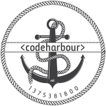

# Sponsorship Agreement

This agreement is in place to ensure that codeHarbour continues to run as an independent and unbiased organization, providing our communities with themed events, resources and support.
Any company or individual wishing to sponsor CodeHarbour and its events, must comply with the following rules and regulations in order to qualify for sponsorship status.
CodeHarbour, as a volunteer organisation, accepts no liability or damages as a result of your sponsorship of us

Going forward, the following terms will be used:
- we, us : The codeHarbour organisation
- you : the organisation represented here by the signing of this document
- Sponsor, Partner: an attainable position with us

## 1. Interaction with the community codeHarbour is run by the community for the community.
While we want sponsors to be able to highlight the latest products and services from their repertoire this is not to be the sole focus of a codeHarbour event.
Below we have compiled a list of acceptable behaviours for sponsoring an event with codeHarbour.

### a. Recruitment
codeHarbour will be allowing recruiters to discuss possible vacancies, separately from the main flow of events (during networking, before/after talks).
Heavily recruiting like integrating into a main talk is prohibited.
### b. Product Placement and Promotion
Companies sponsoring codeHarbour that are wishing to highlight technological advancements or how features benefit their users can be done during talks/events.
Heavily advertising products or services as part of this is prohibited.

## 2. Sponsorship Tiering
Sponsorship is broken down into 2 distinct tiers: Hosts and Partners.

### a. Hosts
Hosts will provide a suitable location for a codeHarbour event, which will be agreed and must comply with the regulations laid out in section 2.c.

### b. Partners
Partners will help provide funds for food, drink, equipment and other necessities for codeHarbour events and operations to ensure events run smoothly and are enjoyable by all.

### c. Location Requirements
Hosts that are providing a location to hold a codeHarbour event must check that the location complies to the following regulations:
- Must be an adequate location to allow talks and presentations to operate in
- Must be large enough to host codeHarbour members
- Ensure the safety of all attendees at the event
- Have adequate wireless internet and access available to attendees and speakers.
- Suitable public liability insurance

### d. Speakers and Call for Papers
Hosts and Partners are encouraged to assist codeHarbour organisers in finding and selecting speakers for codeHarbour talks.
Talk submissions will be made via submitted issues on the codeHarbour [github organisation](https://github.com/codeharbour/codeharbour.github.io).
#### i. Host Specific Speakers/Topics
Should a host wish to have certain topics/speakers/presentations be ran at their hosting location, that host must contact codeHarbour organisers.
codeHarbour will then discuss with other hosts to ensure this nobody has any objections.
#### ii. Host submitting talks intended for hosted events
Any company sponsoring codeHarbour, or one of its events, can submit talks just like any other member.
If the company is hosting and wish for their submitted talk to be run at their hosted event, codeHarbour will try to ensure this happens.
### e. Promoting codeHarbour
Partners and Hosts should be promoting all codeHarbour events, regardless of where or when they are hosted. This is to ensure the mutual success and growth of the event as we work together.
#### i. codeHarbour Assets
codeHarbour will provide assets and promotional material(both physical and digital) to aid in promoting codeHarbour events
### f. Digital Content and Shutouts
All partners and hosts will have space on our website (www.codeharbour.co.uk) to provide information and links about them.
codeHarbour will also be displaying sponsor information in our social media presence, along with before, during and after codeHarbour events (where it is best suited).
Sponsors will also have space on the meetup page, similar to the website space.
## 3. Sponsorship exit clauses
**a.** Codeharbour retains the right to exit this agreement if any of the above clauses have been seen to be broken.

I agree on behalf of my company to abide by the rules of this sponsorship agreement

Name:
______________________________________

Company (if applicable):
_______________________________________
